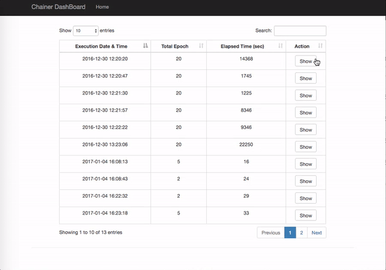

## About
This is a dashboard-like app for visualizing `log` file that is dumped by chainer's `training.extensions.LogReport` method.

## Requirements
* Flask (and its dependencies)

## Directory Structure
This app assumes that the result of the experiment is organized by the following manner.

```
result/
　├ YYYYMMDD_HH_mm_ss/
　│　└ log  # dumped by chainer
　│　└ setttings.json  # create this by yourself
　├ YYYYMMDD_HH_mm_ss/
　└ YYYYMMDD_HH_mm_ss/
```

Here, `settings.json` is a dictionary object that contains hyperparamers.
Typically obtained by saving all the arguments provided to `argparse` module.
For example,
```python
### set hyperparameters ###
parser.add_argument('--gpu  ', dest='gpu', type=int,
                    default=-1, help='GPU ID (Negative value indicates CPU)')
parser.add_argument('--epoch', dest='epoch', type=int,
                    default=72, help='Number of times to iterate through the dataset')
parser.add_argument('--batchsize', dest='batchsize', type=int,
                    default=20, help='Minibatch size')
args = parser.parse_args()

### save hyperparameters ###
json.dumps(vars(args), sort_keys=True)
```

`log` is the file dumped by chainer's `training.extensions.LogReport` method.

## Usage
Execute `runserver` and access `http://localhost:5555/`
